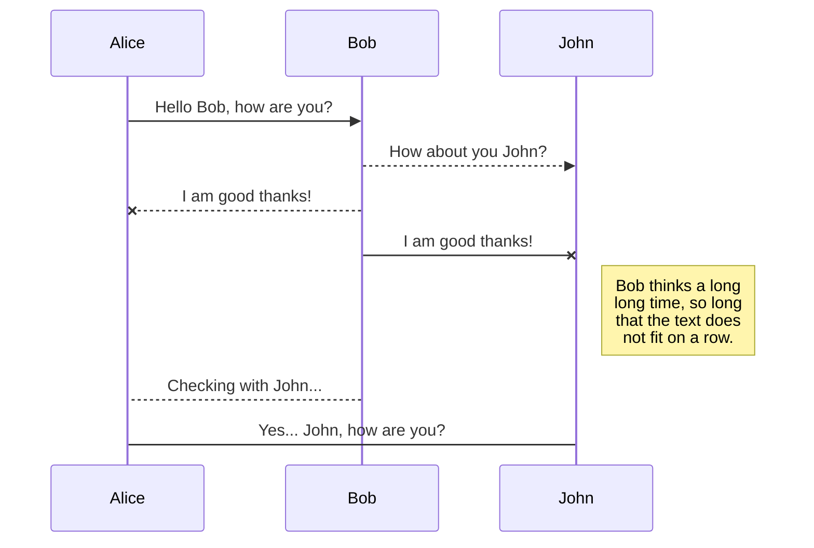
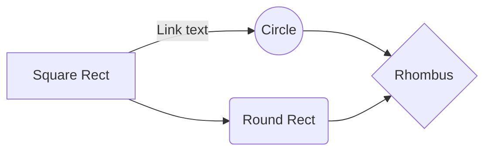

# Crisis Information System for Retail Customers
Backend is available at 'retailWeb/PRIS'?
Frontend is available at 'retailWeb/pris-frontend'?

## Requirements
- [JDK 1.8](http://www.oracle.com/technetwork/java/javase/downloads/index.html)  or later
- [Gradle 4+](http://www.gradle.org/downloads)  or  [Maven 3.2+](https://maven.apache.org/download.cgi)
- [MySQL 8.0](https://dev.mysql.com/doc/refman/8.0/en/installing.html) installed and created a database with followed characteristics:    

`database_name=PRIS on http://localhost:3306/PRIS;      
username=root;     
password=1234;`

### Optional
Import **all** given CSV example files located in .... into the database PRIS by executing followed SQL Command on MySQL CommanLine:  
`LOAD DATA LOCAL  
INFILE '/pathToDownloadedCSVFile/tablename.csv'  
INTO TABLE tablenname  
FIELDS TERMINATED BY ';'   
LINES TERMINATED BY '\n'              
IGNORE 1 LINES`  

**Note:** Make sure to follow this order by importing the files:

## Start Application
 1. **Run Backend** jar file located at ....:  
 a) Via Command Line: $PathToWhereJarFileIsLocated `java -jar pris.jar` oderso  
 b) Via IDE: Open/Pull Backend, run as Spring Boot Application  
 2. **Run Frontend** jar file located at ...:

## SmartyPants
SmartyPants converts ASCII punctuation characters into "smart" typographic punctuation HTML entities. For example:
|                |ASCII                          |HTML                         |
|----------------|-------------------------------|-----------------------------|
|Single backticks|`'Isn't this fun?'`            |'Isn't this fun?'            |
|Quotes          |`"Isn't this fun?"`            |"Isn't this fun?"            |
|Dashes          |`-- is en-dash, --- is em-dash`|-- is en-dash, --- is em-dash|

## KaTeX

You can render LaTeX mathematical expressions using [KaTeX](https://khan.github.io/KaTeX/):

The *Gamma function* satisfying $\Gamma(n) = (n-1)!\quad\forall n\in\mathbb N$ is via the Euler integral

$$
\Gamma(z) = \int_0^\infty t^{z-1}e^{-t}dt\,.
$$

> You can find more information about **LaTeX** mathematical expressions [here](http://meta.math.stackexchange.com/questions/5020/mathjax-basic-tutorial-and-quick-reference).

## UML diagrams

You can render UML diagrams using [Mermaid](https://mermaidjs.github.io/). For example, this will produce a sequence diagram:

And this will produce a flow chart:

